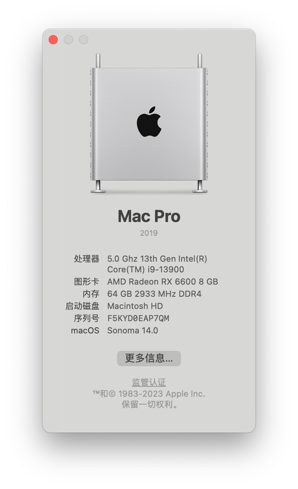

# 铭瑄挑战者 H610ITX 2.5G 黑苹果
Items | Details
--- | ---
CPU | i9 13900 注意，大小核心需要开启所有线程的话，需要禁用SMCProcessor.kext,开启ProvideCurrentCpuInfo
主板 |  MAXSUN H610ITX ([BIOS](https://www.maxsun.com.cn/2022/0512/5728.html):E1.6G)
显卡 | Radeon™ RX 6600 8GB GDDR6
Wifi |  BCM943602CS
内存 | 光威 天策 32GB 3200*2, 主板BIOS限制，目前只能2933，3200需要手动设置更细的参数，懒得折腾了。 
硬盘 | 1TB NVME(MacOS) +1TB SATA(Windows) 
OpenCore | 0.9.3 

 BIOS设置 | 是否启用 
--- | ---
 Hyper-Threading | Enable
 VT-d Enable Above 4G decoding | Enable
 Resizable Bar | Enable
 EHCI/XHCI Hand-off | Enable
 Wake on USB | Enable
 Wake on Bluetooth | Enable
 CFG Lock | Disable
 Security Device Support | Disable
 Serial/COM Port | Disable
 CSM Support | Disable
 Fast Boot | Disable
 Secure Boot | Disable
 Trusted platform Module | Disable
 Wake on LAN | Disable
